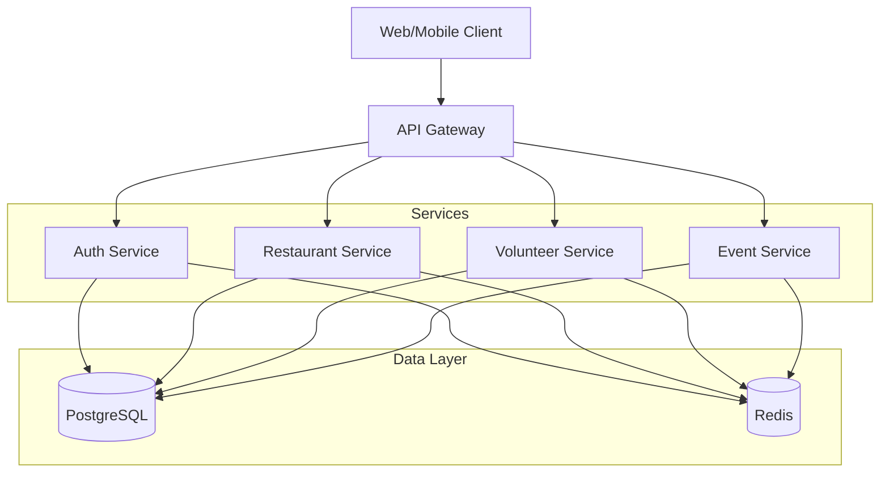
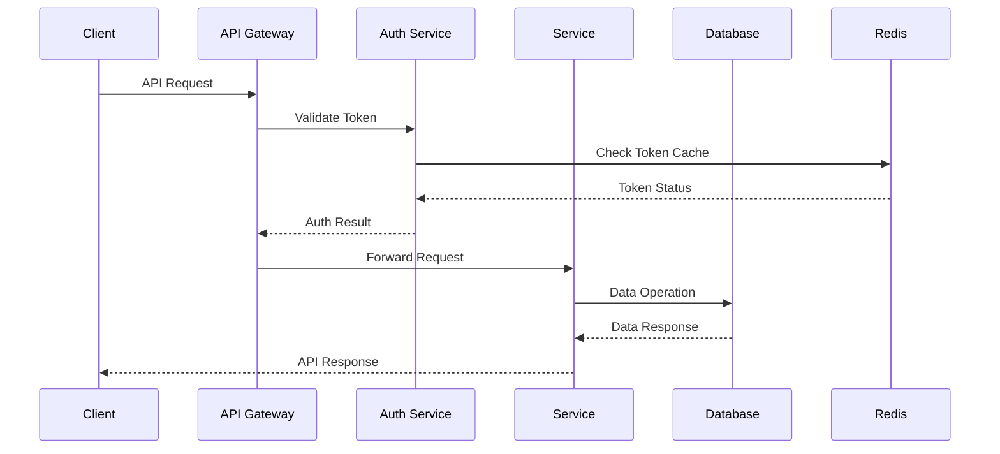
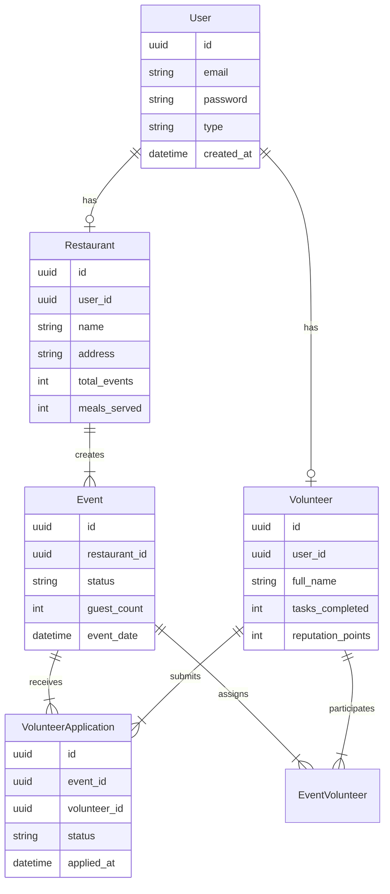
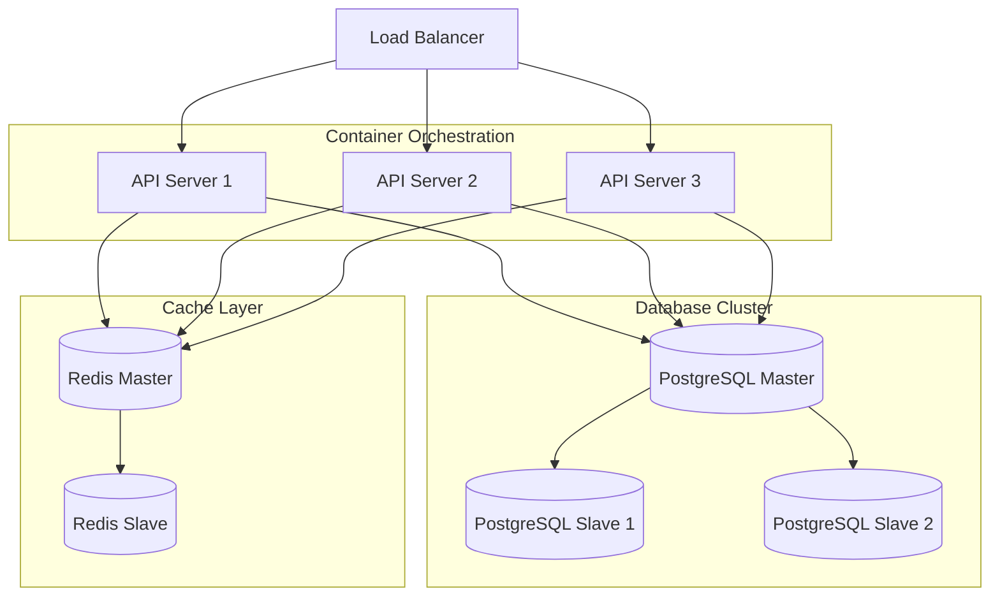

# Tatawo3 Backend
## Overview

The Tatawo3 Backend is a robust API service designed to connect restaurants with surplus food to volunteers who can distribute it to those in need. This platform aims to reduce food waste while addressing food insecurity in communities.

## Architecture

The application follows a clean architecture pattern with clear separation of concerns:

```
├── internal/
│   ├── adapters/           # External interfaces (HTTP, DB, etc.)
│   │   ├── config/         # Application configuration
│   │   ├── http/           # HTTP handlers and routers
│   │   │   └── gin/        # Gin framework implementation
│   │   └── repositories/   # Data access implementations
│   │       └── postgres/   # PostgreSQL implementations
│   ├── core/               # Business logic
│   │   ├── application/    # Use cases and services
│   │   ├── domain/         # Domain models and business rules
│   │   └── ports/          # Interface definitions
│   └── utils/              # Utility functions
└── cmd/                    # Application entry points
```

### Key Components

1. **Domain Layer**: Contains the business entities and rules
2. **Application Layer**: Implements use cases and orchestrates domain objects
3. **Ports Layer**: Defines interfaces for external adapters
4. **Adapters Layer**: Implements external interfaces (HTTP, DB, etc.)

### Data Flow

1. HTTP request → Gin Router → Handler
2. Handler → Service → Repository
3. Repository → Database
4. Response flows back through the same layers

## System Architecture Diagrams

### High-Level System Architecture


The high-level architecture diagram shows how different components interact within the system. The API Gateway serves as the entry point, routing requests to appropriate services while the data layer handles persistence and caching.

### Request Flow Diagram


This sequence diagram illustrates how a typical request flows through the system, including authentication and data operations.

### Entity Relationship Diagram


The ER diagram shows the relationships between different entities in the system and their key attributes.

### Deployment Architecture


The deployment diagram shows how the application is deployed across multiple servers with load balancing, database replication, and caching infrastructure.

## Technologies

- **Go**: Primary programming language
- **Gin**: HTTP web framework
- **GORM**: ORM for database operations
- **PostgreSQL**: Primary database
- **JWT**: Authentication mechanism
- **Swagger**: API documentation
- **Docker**: Containerization

## Key Features

### Authentication
- User registration (volunteer/restaurant)
- Login/logout
- JWT token management

### Restaurant Dashboard
- Event management (create, update, delete)
- Volunteer application management
- Statistics (meals served, events hosted)

### Volunteer Dashboard
- View upcoming tasks
- Discover nearby opportunities
- Apply for events
- Check-in functionality
- Badge/achievement system

## API Endpoints

### Authentication
- `POST /api/v1/auth/register_restaurant`: Register a new restaurant
- `POST /api/v1/auth/register_volunteer`: Register a new volunteer
- `POST /api/v1/auth/login`: Login a user
- `POST /api/v1/auth/refresh`: Refresh authentication token
- `POST /api/v1/auth/logout`: Logout user

### User Management
- `GET /api/v1/user/me`: Get current user profile
- `PUT /api/v1/user/me`: Update current user profile

### Restaurant Operations
- `GET /api/v1/restaurant/dashboard`: Get restaurant dashboard
- `POST /api/v1/restaurant/events`: Create a new event
- `GET /api/v1/restaurant/events/:id`: Get event details
- `PUT /api/v1/restaurant/events/:id`: Update event
- `DELETE /api/v1/restaurant/events/:id`: Delete event
- `GET /api/v1/restaurant/applications`: Get volunteer applications
- `POST /api/v1/restaurant/applications/:id/approve`: Approve application
- `POST /api/v1/restaurant/applications/:id/decline`: Decline application

### Volunteer Operations
- `GET /api/v1/volunteer/dashboard`: Get volunteer dashboard
- `GET /api/v1/volunteer/upcoming-tasks`: Get upcoming tasks
- `GET /api/v1/volunteer/nearby-opportunities`: Get nearby opportunities
- `GET /api/v1/volunteer/badges`: Get earned badges
- `POST /api/v1/volunteer/events/:id/apply`: Apply for an event
- `POST /api/v1/volunteer/events/:id/check-in`: Check in for an event

## Getting Started

### Prerequisites
- Go 1.24+
- PostgreSQL 16.3+
- Docker (optional)

### Setup

1. Clone the repository:
```bash
git clone https://github.com/SOU9OUR-DCF/dcf-backend.git
cd dcf-backend
```

2. Set up environment variables:
```bash
cp .env.example .env
# Edit .env with your configuration
```

3. Run the application:
```bash
# Without Docker

APP_ENV=dev go run cmd/api/main.go --config internal/adapters/config

# With Docker
docker-compose -f docker-compose.buidl.yaml up -d --build
```

4. Access the API documentation:
```
http://localhost:8080/swagger/index.html
```


